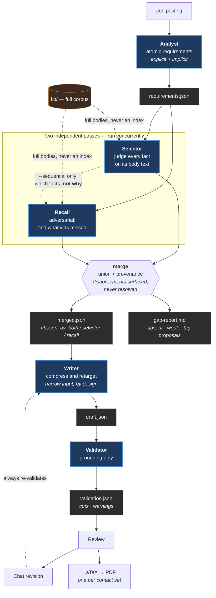
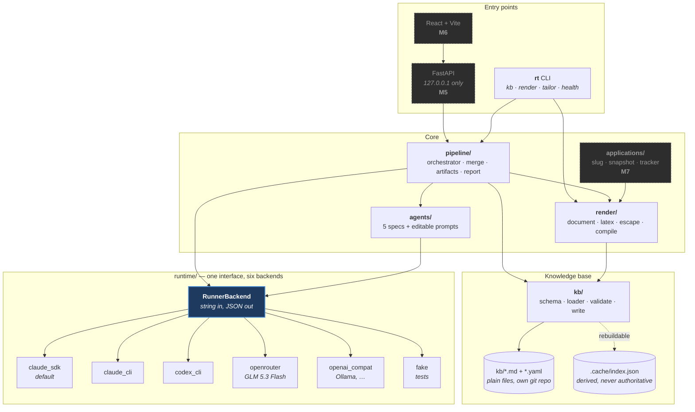
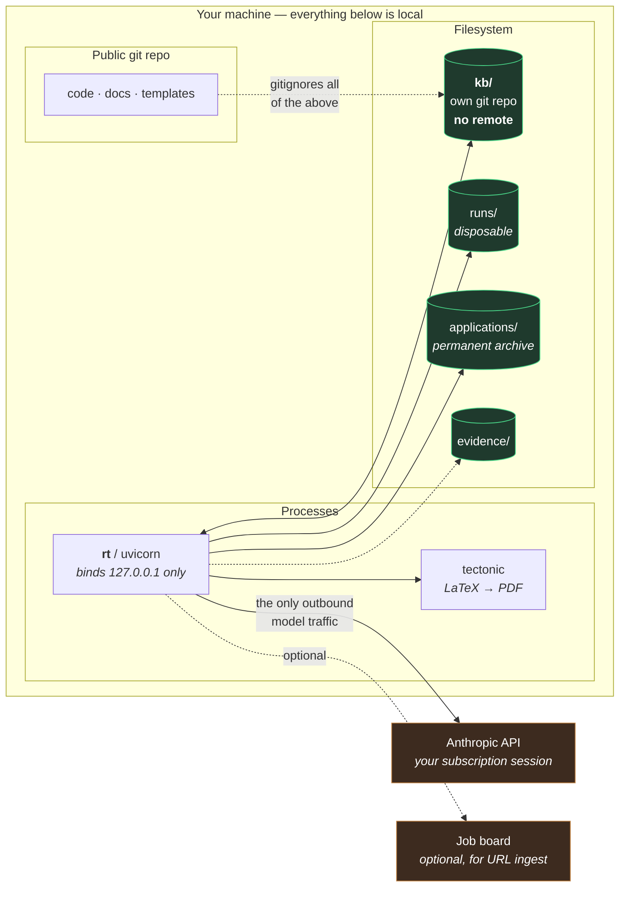

# resume-tailor

A local, single-user system that tailors a resume to a job description from a complete personal career knowledge base — then shows what matched, what's missing, and lets you revise by chat before exporting a PDF.

**Status:** milestones M1–M8 are built and merged. It runs end to end today on Claude and on Codex: paste a posting, watch the agents work, review what matched and what's missing, revise by chat, export PDFs, and archive what you sent. See [What it does today](#what-it-does-today), [Current challenges](#current-challenges) and [Future scope](#future-scope).

## Setup and run

You do not need a programming background. You will paste commands into a terminal. After each install, run the **Check** so you know it worked. Plan about 15 minutes.

### 1. Open a terminal

| Computer | What to open |
|---|---|
| **macOS** | Spotlight (`Cmd+Space`), type `Terminal`, press Return |
| **Windows** | Start menu, type `PowerShell`, open **Windows PowerShell** or **Terminal** |
| **Linux** | Open **Terminal** from the applications menu |

Leave this window open. You will paste into it.

### 2. Prerequisites

Install these five things, then come back. Skip any whose check already succeeds.

| Need | What it is for | Check (paste this) | You want to see |
|---|---|---|---|
| **Git** | Downloads the project | `git --version` | `git version 2…` |
| **Python 3.12 or newer** | Runs the app | `python3 --version` (Windows: `py -3 --version`) | `Python 3.12` or `3.13`… |
| **Node.js 20 or newer** | Builds the web page | `node --version` then `npm --version` | `v20…` / `v22…` and an npm version |
| **Tectonic** | Turns a resume into a PDF | `tectonic --version` | a version number |
| **An AI account** | Writes the tailored resume | Open Settings after the app starts | Claude, Codex, or an OpenRouter key |

Close and reopen the terminal after each installer, then run the check again.

#### Git

- **macOS:** paste `xcode-select --install` and follow the dialog. Or download [git-scm.com](https://git-scm.com/download/mac).
- **Windows:** download [git-scm.com](https://git-scm.com/download/win). Keep the defaults. Tick **Git from the command line** if you see that option.
- **Linux (Debian/Ubuntu):** `sudo apt update && sudo apt install -y git`

#### Python 3.12 or newer

- **macOS / Windows:** download **Python 3.12** (or newer) from [python.org/downloads](https://www.python.org/downloads/). On Windows, tick **Add python.exe to PATH** on the first installer screen.
- **Linux (Debian/Ubuntu):**

```bash
sudo apt update && sudo apt install -y python3.12 python3.12-venv python3.12-dev
```

If `python3.12` is not found, install from the [deadsnakes PPA](https://launchpad.net/~deadsnakes/+archive/ubuntu/ppa) (`sudo add-apt-repository ppa:deadsnakes/ppa` then the command above) or pick a newer distro package that is 3.12+.

**Check:** `python3 --version` on macOS and Linux. On Windows use `py -3 --version`. If that prints 3.11 or older, the installer did not land on your PATH — reopen the terminal, or reinstall and tick **Add to PATH**.

#### Node.js 20 or newer (LTS)

Download the **LTS** installer from [nodejs.org](https://nodejs.org/). Run it, accept the defaults, then reopen the terminal.

**Check:** `node --version` and `npm --version`.

#### Tectonic (PDF engine, ~70MB)

Pick one. The official one-liner drops the program in the folder you are in; the extra line moves it onto your PATH so `tectonic` works everywhere.

**macOS** (Homebrew, easiest if you have it):

```bash
brew install tectonic
```

If you do not have Homebrew, install it from [brew.sh](https://brew.sh/) first, or use the copy-paste installer below.

**macOS and Linux** (no Homebrew):

```bash
curl --proto '=https' --tlsv1.2 -fsSL https://drop-sh.fullyjustified.net | sh
mkdir -p "$HOME/.local/bin"
mv -f tectonic "$HOME/.local/bin/tectonic"
echo 'export PATH="$HOME/.local/bin:$PATH"' >> "$HOME/.zshrc" 2>/dev/null || true
echo 'export PATH="$HOME/.local/bin:$PATH"' >> "$HOME/.bashrc" 2>/dev/null || true
export PATH="$HOME/.local/bin:$PATH"
```

On Linux, `sudo apt install tectonic` or `sudo pacman -S tectonic` also works when your distro ships it.

**Windows** (PowerShell):

```powershell
[System.Net.ServicePointManager]::SecurityProtocol = [System.Net.ServicePointManager]::SecurityProtocol -bor 3072
iex ((New-Object System.Net.WebClient).DownloadString('https://drop-ps1.fullyjustified.net'))
$bin = Join-Path $HOME "bin"
New-Item -ItemType Directory -Force $bin | Out-Null
Move-Item -Force .\tectonic.exe (Join-Path $bin "tectonic.exe")
$userPath = [Environment]::GetEnvironmentVariable("Path", "User")
if ($userPath -notlike "*$bin*") {
  [Environment]::SetEnvironmentVariable("Path", "$bin;$userPath", "User")
}
$env:Path = "$bin;$env:Path"
```

If you already use Scoop: `scoop bucket add extras; scoop install tectonic`.

**Check:** `tectonic --version`. The first PDF later needs internet once, so Tectonic can fetch LaTeX packages.

#### An AI account (needed to tailor a resume)

The app starts without this. Tailoring a job posting needs one of:

- a [Claude](https://claude.ai/) account with Claude Code / the Claude CLI signed in, or
- a ChatGPT account with [Codex](https://chatgpt.com/) / the Codex CLI signed in, or
- an [OpenRouter](https://openrouter.ai/) API key

You pick the backend in **Settings** after the web page opens.

### 3. Download the project

**macOS / Linux:**

```bash
git clone https://github.com/amal-krishna-m-u/resume-modifier.git
cd resume-modifier
```

**Windows (PowerShell):**

```powershell
git clone https://github.com/amal-krishna-m-u/resume-modifier.git
cd resume-modifier
```

If you already downloaded a ZIP from GitHub, unzip it and `cd` into that folder instead. Stay in this folder for the next steps. Use the URL on the green **Code** button if it differs.

### 4. Install the app

**macOS / Linux:**

```bash
python3 -m venv .venv
.venv/bin/python -m pip install -U pip
.venv/bin/pip install -e .
```

**Windows (PowerShell):**

```powershell
py -3 -m venv .venv
.\.venv\Scripts\python -m pip install -U pip
.\.venv\Scripts\pip install -e .
```

If `py -3` is not recognized, use `python -m venv .venv` instead.

**Check:** macOS/Linux: `.venv/bin/rt --help`. Windows: `.\.venv\Scripts\rt.exe --help`. You should see a list of commands.

### 5. Build the web page (once)

**macOS / Linux:**

```bash
cd web && npm install && npm run build && cd ..
```

**Windows (PowerShell):**

```powershell
cd web; npm install; npm run build; cd ..
```

**Check:** a `web/dist` folder exists after this. You only redo this step when the web code changes.

### 6. Create your identity file

This is your name and contact details on the resume. The real file stays on your computer and is never committed to the public repo.

**macOS / Linux:**

```bash
mkdir -p kb/roles kb/facts kb/projects kb/blogs kb/education kb/certifications kb/awards
cp kb/identity.example.yaml kb/identity.yaml
git init kb
```

**Windows (PowerShell):**

```powershell
New-Item -ItemType Directory -Force kb/roles, kb/facts, kb/projects, kb/blogs, kb/education, kb/certifications, kb/awards | Out-Null
Copy-Item kb/identity.example.yaml kb/identity.yaml
git init kb
```

Open `kb/identity.yaml` in any text editor. Put your name, email, and phone in. Save.

**Check:**

- macOS/Linux: `.venv/bin/rt kb validate`
- Windows: `.\.venv\Scripts\rt.exe kb validate`

### 7. Start the app

**macOS / Linux:**

```bash
.venv/bin/rt start
```

**Windows (PowerShell):**

```powershell
.\.venv\Scripts\rt.exe start
```

Open [http://127.0.0.1:8000](http://127.0.0.1:8000) in your browser. In **Settings**, pick Claude, Codex, or OpenRouter and press **Test connection**.

`rt stop` closes it. `rt serve` is the same server in the foreground (the window stays busy until you press Ctrl+C).

### Use `rt` from any folder

After this, you can type `rt start` in a new terminal without `cd` into the project. Do **not** move the project folder after you set this up. If you do, run these commands again.

The wrappers in `bin/` point at this project's `.venv` and set `RESUME_TAILOR_ROOT`, so start, stop, and tailor always use **this** knowledge base.

#### macOS

```bash
mkdir -p "$HOME/.local/bin"
ln -sf "$(pwd)/bin/rt" "$HOME/.local/bin/rt"
ln -sf "$(pwd)/bin/rs.local" "$HOME/.local/bin/rs.local"
grep -q '.local/bin' "$HOME/.zshrc" 2>/dev/null || echo 'export PATH="$HOME/.local/bin:$PATH"' >> "$HOME/.zshrc"
export PATH="$HOME/.local/bin:$PATH"
```

macOS Terminal uses **zsh**. If you use bash, append the same `export PATH=…` line to `~/.bash_profile` instead.

**Check:** open a **new** terminal, run `rt --help`.

Optional, so the browser address is `http://rs.local:8000`:

```bash
sudo sh -c 'grep -q "[[:space:]]rs.local" /etc/hosts || echo "127.0.0.1 rs.local" >> /etc/hosts'
```

Then `rs.local` in a terminal starts the UI if needed and opens it.

#### Linux

```bash
mkdir -p "$HOME/.local/bin"
ln -sf "$(pwd)/bin/rt" "$HOME/.local/bin/rt"
ln -sf "$(pwd)/bin/rs.local" "$HOME/.local/bin/rs.local"
```

If `rt --help` fails in a new terminal, add `~/.local/bin` to PATH. **bash:**

```bash
echo 'export PATH="$HOME/.local/bin:$PATH"' >> "$HOME/.bashrc"
source "$HOME/.bashrc"
```

**zsh:**

```bash
echo 'export PATH="$HOME/.local/bin:$PATH"' >> "$HOME/.zshrc"
source "$HOME/.zshrc"
```

**fish:**

```fish
fish_add_path $HOME/.local/bin
```

**Check:** new terminal, `rt --help`.

Optional hosts alias (same as macOS):

```bash
sudo sh -c 'grep -q "[[:space:]]rs.local" /etc/hosts || echo "127.0.0.1 rs.local" >> /etc/hosts'
```

#### Windows (PowerShell)

Run this **in the project folder**. It adds this repo's `bin` directory to your user PATH so `rt` and `rs.local` resolve to `bin\rt.cmd` and `bin\rs.local.cmd`.

```powershell
$bin = (Resolve-Path .\bin).Path
$userPath = [Environment]::GetEnvironmentVariable("Path", "User")
if ($userPath -notlike "*$bin*") {
  [Environment]::SetEnvironmentVariable("Path", "$bin;$userPath", "User")
}
$env:Path = "$bin;$env:Path"
rt --help
```

Close extra terminals and open a new one.

**Check:** `rt --help` from a folder that is **not** the project (for example `cd $HOME`).

Optional, so you can type `http://rs.local:8000` in the browser. Run PowerShell **as Administrator**:

```powershell
$hosts = "$env:SystemRoot\System32\drivers\etc\hosts"
if (-not (Select-String -Path $hosts -Pattern '\srs\.local\s*$' -Quiet)) {
  Add-Content -Path $hosts -Value "127.0.0.1 rs.local"
}
```

#### Windows with WSL

Install the project **inside WSL** (Ubuntu is fine) and follow the **Linux** steps. That is the smoothest Windows path if you already use WSL. Git-Bash can run the `bin/rt` shell wrapper too, once the venv exists.

### If something fails

| Message / symptom | What to do |
|---|---|
| `python3: command not found` / `py` not recognized | Reinstall Python 3.12+ and tick **Add to PATH**. Reopen the terminal. |
| `Python 3.11` (or older) | The default `python3` is too old. Use `python3.12` / `py -3.12` in the venv command. |
| `npm: command not found` | Reinstall Node.js LTS. Reopen the terminal. |
| `tectonic: command not found` | The binary is not on PATH. Redo the Tectonic step, then reopen the terminal. |
| `no kb/ directory` | You are in the wrong folder, or step 6 was skipped. `cd` into the clone. |
| `rt` works in the project folder and nowhere else | The PATH step did not apply to this terminal. Open a **new** window. |
| Browser cannot load the page | Run `rt start` again. Open `http://127.0.0.1:8000` (plain http). |
| Tailoring errors about auth | Open **Settings**, pick a backend, **Test connection**, sign in to that CLI or paste the API key. |

## What it does today

- **Tailors from a full knowledge base.** Five agents (Analyst, Selector, Recall, Writer, Validator); Selector and Recall each read every fact in full, and a Validator cuts any claim without a recorded source.
- **Review before export.** Matched and missing requirements, who selected each fact, what the validator cut, then Direct and Referral PDFs shown inline with a separate Download.
- **Revise by chat.** Each reply, the exact bullets changed and any validator cuts are visible; the PDF refreshes in place.
- **Maintain the knowledge base three ways.** Form, raw Markdown, or a chat assistant that proposes small diffs, pre-checks them, and only writes what you accept.
- **Choose the model in Settings.** Claude (SDK or CLI), Codex, or any OpenAI-compatible endpoint, with a per-backend model and a connection test.
- **Watch the agents live.** An activity panel shows each call, its streaming output, token use, and reasoning when you opt in.
- **Trace and evaluate.** A local trace log, optional self-hosted Langfuse, and evals that compare prompt versions and models, including a fabrication probe for the Validator.
- **Archive what you applied with.** A frozen snapshot of every fact as sent, plus a tracker.
- **Stays private.** Binds to 127.0.0.1, the knowledge base lives in its own remote-less git repository, and traces, evals, runs and applications are gitignored.

## The problem it solves

Manual resume tailoring fails in two directions. Over-claiming is visible and gets punished in interviews. **Silent omission** — a genuinely relevant project you simply didn't think of while editing — is invisible, and you never learn which application it cost you.

Eliminating silent omission is the point. Everything else is mechanism.

## Read in this order

| Document | What it answers |
|---|---|
| [docs/PRD.md](docs/PRD.md) | What is being built, for whom, and what counts as done |
| [docs/traceability.md](docs/traceability.md) | Did every stated requirement survive into the design? **Review this first.** |
| [docs/spec-01-knowledge-base.md](docs/spec-01-knowledge-base.md) | How career data is stored and edited |
| [docs/spec-02-agent-pipeline.md](docs/spec-02-agent-pipeline.md) | The five agents and why selection reads everything |
| [docs/spec-03-runtime-auth.md](docs/spec-03-runtime-auth.md) | Subscription vs API key, and the spike that decides it |
| [docs/spec-04-api-and-ui.md](docs/spec-04-api-and-ui.md) | Endpoints, the write path, the screens |
| [docs/spec-05-latex-rendering.md](docs/spec-05-latex-rendering.md) | LaTeX generation and PDF output |
| [docs/spec-06-provider-backends.md](docs/spec-06-provider-backends.md) | Running on providers other than Claude |
| [docs/spec-07-applications-and-tracker.md](docs/spec-07-applications-and-tracker.md) | Application archive, tracker, dual contact sets |
| [docs/open-questions.md](docs/open-questions.md) | What's still undecided and what each answer blocks |
| [docs/future-scope.md](docs/future-scope.md) | What is deliberately not built yet (API-key providers, hosting) |

`traceability.md` is the fast review surface: every requirement appears there alongside the user's own words that produced it. If something asked for isn't in that table, the PRD is incomplete.

## Three invariants

These are load-bearing, and all three are easy to regress toward their opposite:

1. **Tags never gate retrieval.** Selection reads the full text of every fact. Tags exist for human navigation, audit trails, and second-pass validation. A missing tag must never cause a silent miss.
2. **The knowledge base is the source of truth; LaTeX is generated from it.** Agents edit structured data, never `.tex`.
3. **Every claim traces to a recorded fact.** A validator with no stake in making the resume look good cuts anything that doesn't.

## How it works

Three views: what the agents do, how the code is layered, and where everything
runs. All three are current as of M4 — the pipeline is built; the API and UI
are not.

### The multi-agent pipeline



**Why two selection passes.** The failure this product exists to prevent is
silent omission: a relevant fact that no model ever read, whose absence nobody
notices. One pass with a tag filter in front of it would be cheaper and would
reintroduce exactly that. So both passes read every word of every fact, and
where they disagree the review screen says so rather than a merger picking a
winner.

By default the two run **concurrently**, which halves wall-clock time on the
stage that dominates it; Recall then judges the corpus blind. With
`--sequential` it instead receives the Selector's picks — *which* facts, never
*why* — because a second pass handed the first pass's argument mostly agrees
with it.

**Why the Writer gets less.** Selection and writing have opposite information
needs. Selection wants full fidelity, because relevance hides in any clause.
Writing wants a narrow input, because irrelevant material makes bullets
blander. Conflating them produces an index-based selector, which is the
omission again.

### Architecture



Two seams carry the weight. **`RunnerBackend`** is the only thing the pipeline
knows about a model, so swapping Claude for a local model is configuration, not
a change to any agent. **`Document`** is the only thing the template knows
about content, so the baseline render and a tailored run produce the same shape
and the template knows about neither.

Note what is *not* here: no vector store, no database of record, no queue. The
knowledge base is plain files; `.cache/` is derived and can be deleted at any
time.

### Where it runs

There is no infrastructure to provision. This is a single-user tool that runs
entirely on one machine — no server, no container, no cloud account, and no
Terraform to write. The only thing crossing the network is the model API call
made by the user's own authenticated session.



The green stores never leave the machine. `kb/` is versioned by its own git
repository that has **no remote** — full history locally, nothing published —
because the public repo would otherwise carry the complete career record. The
single action that would undo that is `git -C kb remote add`.

## Your knowledge base stays on this computer

Install and first run are in [Setup and run](#setup-and-run). This section is why `kb/` is separate from the public repo.

The knowledge base is **not in this repository**, by design. After you copy `kb/identity.example.yaml` and `git init kb`, keep that inner repo **without a remote**.

### Why `kb/` has its own git repository

This repository is **public**. `kb/` holds a complete career record — every
employer, location, date and achievement, plus the working notes written
against them. None of that should be indexable under its owner's name.

But the design needs git: history, diff and one-click revert come from commits
rather than from a hand-rolled undo stack (AC-R8.3, [spec-04 §3](docs/spec-04-api-and-ui.md)),
and three different writers touch those files — the browser, a text editor, and
agent-proposed changes.

So `kb/` is versioned by its own repository, which has **no remote**. Both
properties hold at once: full history locally, nothing published. The outer
`.gitignore` excludes everything under `kb/` except `identity.example.yaml`,
which a fresh clone needs.

**Do not add a remote to `kb/`.** That single action is what would publish the
career record, and nothing else in the design prevents it.

### What else stays local

| Path | Why |
|---|---|
| `kb/` | The career record, and `identity.yaml`'s contact details |
| `applications/` | Complete resumes, job descriptions, third-party referrer names |
| `runs/` | Disposable tailoring output; reproducible from `kb/` |
| `chats/` | Your knowledge-base conversations — your career in your own words |
| `evidence/` | Certificates and letters |
| `*.pdf`, `*.docx` | Source resumes dropped in for bootstrapping |

Durability for all of these comes from being plain files in a backed-up home
directory, not from version control ([open-questions OQ-3](docs/open-questions.md)).

## Using it

```bash
rt start                                 # web UI in the background
rt stop                                  # close it
rs.local                                 # start if needed and open the UI
rt fit --file posting.txt                # reuse an existing resume; no model call
rt kb validate                           # the ten rules of spec-01 §4
rt kb stats                              # corpus size — the numbers OQ-2 tracks
rt health                                # backend, auth, Tectonic, context fit

rt render                                # the whole KB, no agents involved
rt tailor --file posting.txt             # the five-agent pipeline
rt tailor --resume <run-id>              # continue from the last completed stage

rt apply <run-id> --company Acme --role "Backend Engineer"
rt applications list --live              # the tracker
rt applications verify                   # re-hash the archive, report drift
```

A `tailor` run writes everything it did into `runs/<id>/`: the requirements it
extracted, both selection passes, the merge, the draft, the validation, the gap
report, and a PDF per contact set. Nothing is hidden, and nothing there is a
source of truth — it is all reproducible from `kb/` plus the posting.

## Milestones

| | Milestone | State |
|---|---|---|
| M1 | Knowledge base: schema, loader, validation, bootstrap | **done** |
| M2 | LaTeX template and PDF output | **done** |
| M3 | Runner backends behind one interface | **done** |
| M4 | The five-agent pipeline, end to end from a CLI | **done** |
| M5 | FastAPI write path and SSE | **done** |
| M6 | React UI | **done** |
| M7 | Application archive and tracker | **done** |
| M8 | Tracing and prompt evals; self-hosted Langfuse optional ([OQ-10](docs/open-questions.md)) | done |

## After you apply

```bash
.venv/bin/rt apply <run-id> --company Acme --role "Backend Engineer" --job-id R1234
```

Promotion is **explicit**. Exporting a PDF does not create a record — you often
export just to look at something. This is the moment the system can know the
content became permanent, so it is the moment it freezes.

What freezes: the rendered resumes, the job description, and a content snapshot
holding the **full text of every fact as it read at send time**. What stays
editable: status, interview stages, referral details, notes.

The snapshot embeds fact bodies rather than referencing them, because a
reference would resolve to the *current* fact. The knowledge base moves on, and
a resume regenerated from today's corpus is not the resume that was sent —
preparing for an interview against reconstructed content is worse than having
no record, because it is confidently wrong.

`rt applications verify` re-hashes everything and reports drift. The archive
lives in `applications/`, company-first, and is gitignored: it holds complete
resumes, job descriptions and third-party referrer names.

## Updating your knowledge base

Three ways, and all three write through the same validated path:

| Mode | Use it for |
|---|---|
| **Form** | A structured editor: tag chips with alias search, depth and visibility with explanations, metric rows |
| **Raw** | The file itself, for anything the form cannot express |
| **Chat** | Describe what you did in your own words; the assistant proposes the entry |

Chat is a third tab beside Form and Raw in every entry, and **Add by chat** covers things that aren't about one entry (a new job, say). It never writes anything. Each proposal is shown as exactly what would change — a new entry in full, or for an update only the part that differs — with its validation result visible before you decide. **Nothing is saved until you accept**, and accepting lands as a commit in your local `kb/` repository, so it can be reverted.

The assistant records only what you tell it. It asks when it needs a number or a date rather than guessing, defaults `depth` to `working` rather than flattering you, and prefers adding to an existing entry over creating a near-duplicate. It cannot delete.

## The run screen

The compiled resume stays on screen while you work. **Revise** (chat), **Sources**, **Matches** and **Gaps** sit beside it.

- **Direct / Referral** only switches which version you are looking at, in place. Nothing downloads until you press **Download PDF** or **.tex**.
- **PDF | LaTeX** shows either one inline; the LaTeX has a copy button for pasting into Overleaf.
- Revising keeps the last verified PDF in view and disables downloads until the new draft's claims have been re-checked.
- Each answer shows what actually changed — a diff computed from the two drafts, beside the model's own account and any claims the validator cut.

## The web interface

```bash
cd web && npm install && npm run build   # once (already done in Setup and run)
rt start                                 # http://127.0.0.1:8000
rt stop                                  # close it
rs.local                                 # start if needed, then open the browser
```

`rt start` detaches the server so you can leave the terminal. `rt serve` is the
same process in the foreground, useful while developing. `rt open` (and the
`rs.local` command) start it if it is down and open the browser.

To run these from any directory, put the wrappers on PATH: [Use `rt` from any folder](#use-rt-from-any-folder) (macOS, Linux, and Windows). Do not move the project after that.

The UI is `http://127.0.0.1:8000`, or `http://rs.local:8000` once the hosts alias is set. Port 80 needs root (`rt start --port 80`) if you want the address with no port number.

The wrapper sets `RESUME_TAILOR_ROOT` to this repository, so start/stop/tailor
keep using this knowledge base even when your cwd is somewhere else.

One process, one port: the API under `/api`, the built bundle served from the
same origin, so there is no CORS configuration to get wrong. In development
`cd web && npm run dev` runs Vite on 5173 and proxies `/api` to the Python
process.

Export is disabled until the review screen has been opened (AC-R4.3). The whole
point is that you see what was cut and what is missing before anything leaves
the machine.

## Choosing Claude, Codex or OpenRouter

Open **Settings** in the web interface (or click the backend badge in the header): pick Claude (Agent SDK or CLI), Codex, OpenRouter, or an OpenAI-compatible server, set a model per backend if you want one, and **Test connection** before saving. OpenRouter reads `OPENROUTER_API_KEY` and defaults to GLM 5.3 Flash; Qwen 3.8 Flash and DeepSeek V4.1 Flash are in the same list. The choice is written to a local, gitignored `resume-tailor.toml` and applies to the next run or message. From a terminal: `RUNNER_BACKEND=openrouter rt tailor --file jd.txt`.

## Tests

```bash
.venv/bin/pytest -q            # live-backend tests are excluded by default
.venv/bin/pytest -q -m live    # hits a real model backend
.venv/bin/ruff check src tests
```

## Validating the docs

```bash
python3 docs/validate_docs.py
```

Stdlib only. Fails on untraced requirements, acceptance criteria without Given/When/Then, specs covering undefined requirements, orphaned criteria, missing source quotes, and dead links.

## Tracing and evals

Answers "did prompt v2 select better than v1?" and "is this model as good as that one?".

**Tracing.** Every agent call (Claude or Codex alike) is recorded in `traces/` on your machine — agent, backend, model, a hash of the agent's prompt, tokens, latency, repairs, errors, and the prompt/output text (set `record_content = false` to keep metadata only). The corpus itself is stored as a hash, never copied. `rt trace summary` and **Settings → Tracing & evals** show calls, errors and cost per agent *per prompt version*.

**Live view.** While a run, a revision or a knowledge-base chat turn is going, the **Agent activity** panel under the progress tracker shows each model call as it happens: which agent, elapsed time, tokens, what it was asked (the knowledge base itself is never repeated), what it is writing right now, and the finished result. It is fed by `GET /api/trace/{run-id}/events` (SSE), and past runs are read back from the local log, so it survives a restart.

**Reasoning is opt-in and backend-dependent.** *Settings → Show model reasoning* asks for it, at the cost of extra tokens and time per call. Codex then reports short reasoning *summaries* (headings, not a full chain of thought). Claude reports thinking summaries only when the model decides a task needs thinking — easy prompts produce none, and the panel says so rather than showing an empty box. `claude_cli` and `openai_compat` show start/finish and tokens but no live text or reasoning.

**Langfuse (optional, self-hosted only).** `ops/langfuse/` has a compose file bound to 127.0.0.1 and a `setup.sh` that generates secrets and an API key pair:

```bash
pip install -e '.[tracing]'
ops/langfuse/setup.sh && (cd ops/langfuse && docker compose up -d)
export LANGFUSE_PUBLIC_KEY=... LANGFUSE_SECRET_KEY=...      # printed by setup.sh
# resume-tailor.toml:  [observability]  langfuse = true
rt trace status                                             # confirms it connects
```

A non-local host is refused: traces contain your whole knowledge base. Runs then appear in Langfuse as one trace each, a generation per agent, tagged with the prompt version; eval scores are attached to the eval traces.

**Evals.**

```bash
rt eval build <run-id> --name fintech     # snapshot a finished run as a case
# edit evals/cases/fintech.json: fix must_include / must_exclude, set "reviewed": true
rt eval run --label baseline              # re-run Analyst, Selector, Recall + validator probe
# change a prompt in src/resume_tailor/agents/prompts/, or the model, then:
rt eval run --label tighter-selector
rt eval compare baseline tighter-selector # which prompt versions differ, and the score deltas
```

Scores per case: `recall` (expected facts found), `exclusions` (picks you marked wrong), `stability` (agreement with the baseline run), and `validator_catches_fabrication` — a made-up bullet is injected into a real draft and the Validator must cut or flag it. **A case built from a run is `reviewed: false`: its scores mean "consistent with that run", not "correct", until you correct the file.** `compare` says when nothing differs between two results, so run-to-run noise isn't mistaken for improvement. Cases and results live in `evals/` (gitignored: they contain real postings).

## Current challenges

Honest limits as of today, roughly in order of how much they affect the output.

**Your knowledge base is thin.** Selection can only choose what is recorded, and it is the biggest limit on quality. On the real data the most-selected fact held 21 words, and the whole knowledge base about 357. The writer compresses detail; it cannot invent it. The *Expand these first* list in the knowledge base screen ranks entries by how often runs actually used them, so start there.

**Whole-corpus selection costs tokens and will not scale forever.** Every call resends the entire knowledge base. Claude caches that prefix (about 100% of prompt tokens cached in one run); Codex cached about 38%. The OpenAI-compatible backend has no caching, so a metered API pays full price on every call. The provisional re-think point is 500 entries or 100K tokens ([OQ-2](docs/open-questions.md)).

**Model behaviour differs between backends, and nothing enforces a schema.** Codex returned metrics as plain strings and the curator's reply claimed they were recorded, so proposals are now sanitised and the reply corrected, but each new backend can surface another shape. The Validator is the one agent that fails invisibly, which is why it has its own fabrication probe.

**Evals are only as good as their cases.** A case built from a run is `reviewed: false`: its scores mean "consistent with that run", not "correct", until you correct `must_include` and `must_exclude`. There is one case today, so a delta between two results can still be noise; `rt eval compare` says when nothing differs.

**Reasoning visibility is limited by the providers.** Codex exposes short reasoning summaries (headings), not a full chain of thought. Claude shows thinking only when the model decides a task needs it. `claude_cli` and `openai_compat` show start, finish and tokens only. Turning reasoning on costs tokens on every call.

**Some pieces are unverified.** The Langfuse Docker compose has not been run (no Docker on the development machine); the exporter is checked only against a stand-in for Langfuse's endpoint, and `rt trace status` is the real check. API-key use (`ANTHROPIC_API_KEY`, Vertex, Bedrock) is untested. Whether Codex works on a free ChatGPT plan is unconfirmed.

**Subscription limits apply.** The default backends run on your Claude or ChatGPT subscription, so heavy use (a full run is five calls, plus every revision and chat turn) can hit rate limits ([RK-2](docs/PRD.md)).

**One person, one machine.** No login, local-only binding, file-and-git storage. Hosting and multi-user are future scope, not a configuration change.

**Smaller gaps.**
- A job link cannot be fetched; paste the text or upload a file.
- Recall's tag suggestions are not yet routed into the chat inbox.
- LaTeX output matches the section order and structure of the original PDF exactly, but font metrics differ slightly (accepted).
- A run in progress keeps the backend it started with; changing it in Settings applies to the next run, and is refused while one is active.

## Future scope

Not built yet, on purpose: API-key providers as first-class backends (Anthropic, Vertex, Bedrock, OpenAI, Gemini; no CLI), and hosting (auth, HTTPS, persistent storage). What exists today, what is missing and why it waits: [docs/future-scope.md](docs/future-scope.md).

## Contributing and contact

Contributions are welcome: see [CONTRIBUTING.md](CONTRIBUTING.md) (setup, checks, and the privacy rules, which matter because this repository is public) and [CONTRIBUTORS.md](CONTRIBUTORS.md).

**Amal Krishna M.U** — [amalkrishnam3@gmail.com](mailto:amalkrishnam3@gmail.com) · [LinkedIn](https://www.linkedin.com/in/amal-krishna-m-u-4055a1185/) · [GitHub](https://github.com/amal-krishna-m-u) · [xpar.in](https://xpar.in) · [Medium](https://medium.com/@amalmullangathtech)

## Next step

Review your first eval cases (`rt eval build`, then correct `must_include`) and use
`rt eval compare` to settle OQ-6 — which model for which agent — with numbers.
